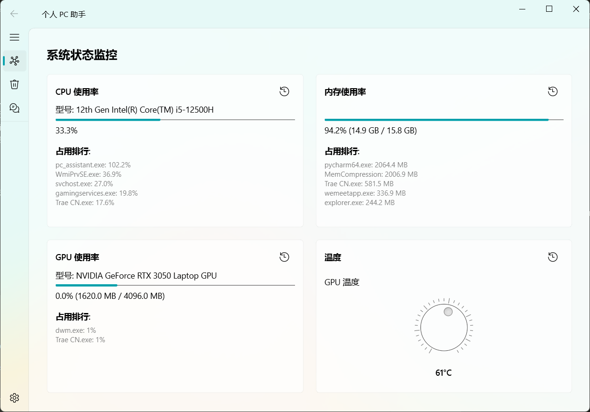
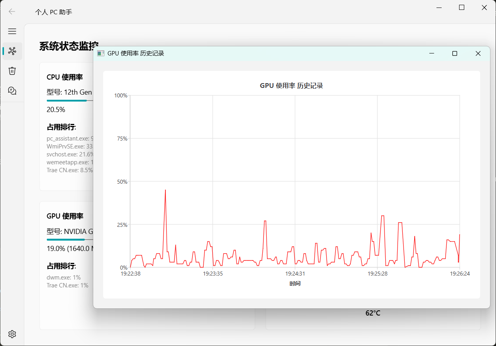
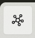
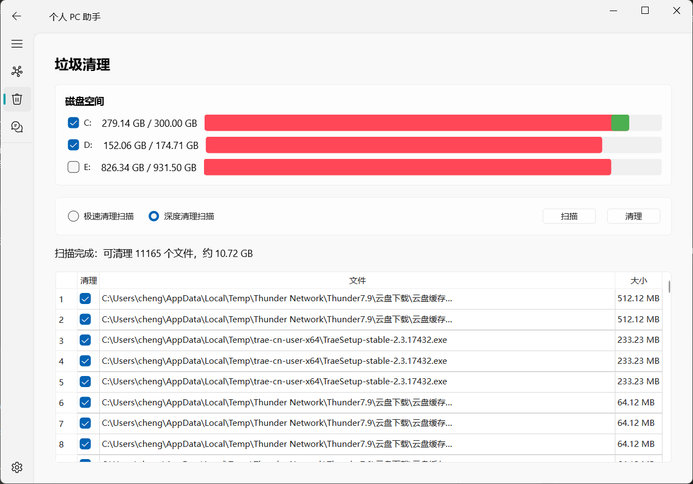

# Personal PC Assistant

## 项目说明

> ⚠️ **重要提示**：本项目由 AI 独立编写完成，作者本人一行代码未写。本项目作为 AI 编程能力的 Demo 展示，仅供学习和参考。

这是一个完全由 AI 辅助开发的 Windows 桌面应用程序，具备系统监控、垃圾清理、AI 助手等功能模块，并为用户提供友好的界面和操作体验。

## 功能特性

| 模块 | 功能 | 状态 |
| :--- | :--- | :--- |
| **系统监控** | 实时显示 CPU、内存、磁盘、网络使用情况 | ✅ 已完成 |
| **垃圾清理** | 智能扫描并清理系统垃圾文件 | ✅ 已完成 |
| **AI 助手** | AI 驱动的智能助手功能 | 🔄 待实现 |
| **插件系统** | 可扩展的插件机制 | 🔄 待实现 |

## 效果展示

### 系统监控界面
- 📊 **CPU 监控**：实时显示处理器占用率
- 💾 **内存监控**：显示虚拟内存使用情况
- 🖥️ **GPU 监控**：支持 NVIDIA GPU 温度和使用率显示
- 💿 **磁盘监控**：监控各磁盘分区使用情况
- 📈 **数据曲线**：从启动程序开始记录所有数据，实时绘制变化曲线
- 🔋 **后台模式**：最小化时自动降低数据采样率，减少性能占用
- ⚙️ **开机自启**：设置界面可一键开启/关闭开机自启动
- 🟢 **系统托盘**：支持最小化到 Windows 系统托盘，后台运行
 




### 垃圾清理功能
- 🔍 支持选择快速扫描或深度扫描对垃圾文件进行定位
- 📁 支持按盘符选择清理位置
- 🛡️ 扫描后可人为筛选清理项


## 技术栈

| 类别 | 技术 | 说明 |
| :--- | :--- | :--- |
| GUI 框架 | PySide6 | 原生 Windows 11 风格，高性能 |
| 系统监控 | psutil, GPUtil | 跨平台系统/进程监控 |
| 文件操作 | pathlib, send2trash | 安全现代化的文件系统操作 |
| AI 集成 | openai / ollama | 云端 GPT 或本地 DeepSeek/Llama |
| 异步处理 | asyncio, QThread | 防止 UI 在重任务中卡顿 |
| 打包工具 | PyInstaller | 打包为独立 EXE |

## 项目结构

```
personal_pc_assistant/
├── main.py                 # 程序入口
├── main.spec               # PyInstaller 打包配置
├── core/                   # 核心模块
│   ├── monitor.py          # 系统监控
│   ├── cleaner.py          # 垃圾清理
│   ├── ai_engine.py        # AI 集成（待实现）
│   └── data_logger.py      # 数据记录
├── ui/                     # UI 组件
│   └── main_window.py      # 主窗口
├── build/                  # 打包输出目录
├── dist/                   # 发布的 exe 目录
└── requirements.txt        # 依赖清单
```

## 运行方式

### 环境要求
- Windows
- Python 3.8+

### 安装依赖
```bash
pip install -r requirements.txt
```

### 运行程序
```bash
python main.py
```

## 
